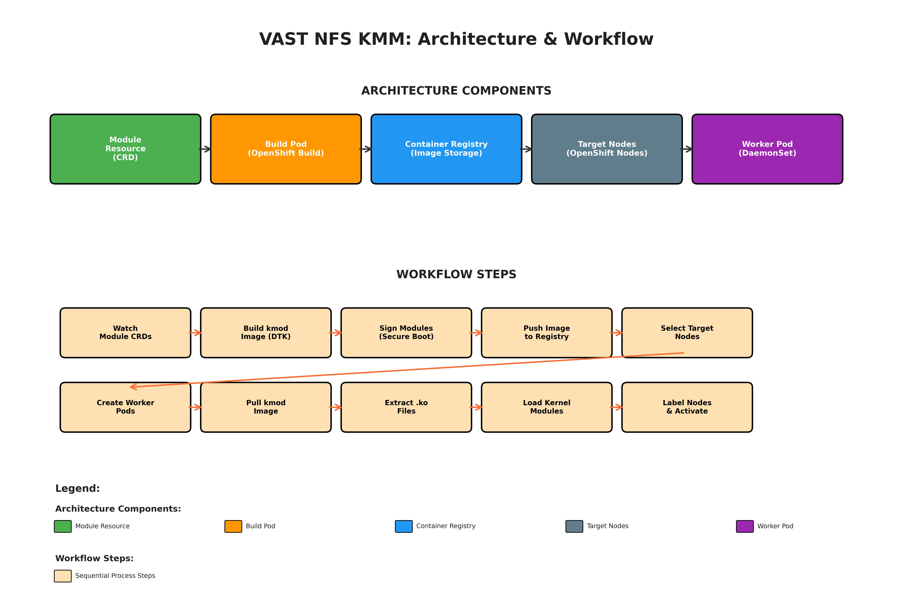
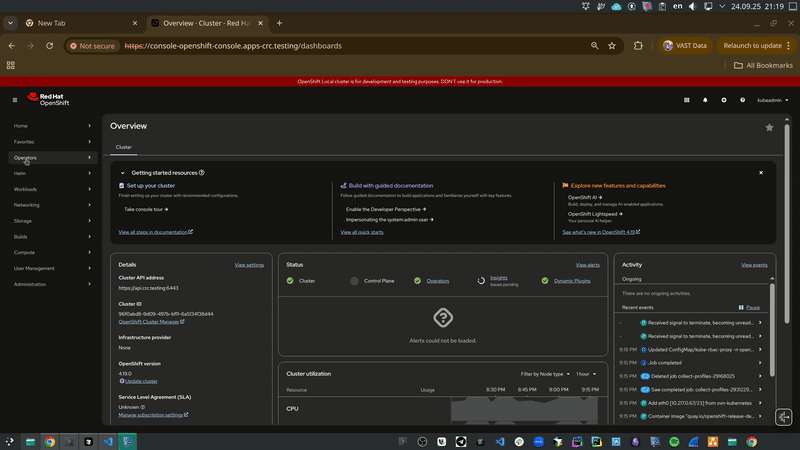

# VAST NFS KMM (Kernel Module Management) for OpenShift

This repository provides automated deployment of VAST NFS kernel modules on OpenShift using the Kernel Module Management (KMM) operator.

## Table of Contents

- [Overview](#overview)
- [Prerequisites](#prerequisites)
- [Quick Start](#quick-start)
- [Installation Methods](#installation-methods)
- [Usage](#usage)
- [Verification](#verification)


## Overview

VAST NFS KMM enables automatic deployment and management of VAST NFS kernel modules across OpenShift clusters using the Kernel Module Management (KMM) operator.

### About VAST NFS Driver

The **VAST NFS package** provides a modified version of the Linux NFS client and server kernel code stacks, containing backported upstream NFS stack code from **Linux v5.15.x LTS** kernel branch. This allows older kernels to receive the full functionality of newer NFS stack code with enhanced features including:

- **NFS stack improvements and fixes**
- **Multipath support for NFSv3 and NFSv4.1**
- **Nvidia GDS integration**
- **Support for kernels 4.15.x and above**

For complete VAST NFS driver documentation, see: [VAST NFS Documentation](https://vastnfs.vastdata.com/docs/4.0/Intro.html)

### KMM Operator Features

This KMM operator handles the automated installation and management of the VAST NFS driver, providing:

- **Automatic kernel module building and loading**
- **Multi-node deployment via DaemonSet**
- **Secure boot environments**
- **Comprehensive verification**
- **Clean uninstallation**

### Architecture



## Prerequisites

### Required Tools
- `oc` or `kubectl` CLI tool
- `kustomize` (automatically installed if missing)
- OpenShift cluster with KMM operator installed
- Cluster admin privileges

### KMM Operator Installation
If KMM operator is not installed:




## Quick Start

```bash
# Clone the repository
git clone https://github.com/vast-data/openshift-vastnfs-kmm-operator
cd openshift-vastnfs-kmm-operator

# Install VAST NFS KMM (includes real-time log monitoring)
make install

# Wait for deployment to complete (see timing note below)
# then verify deployment
make verify

# Uninstall
make uninstall
```

**Important Timing Note:** After `make install` completes the build stage, please wait approximately 1-2 minutes before running `make verify`. This allows time for:

- The built kernel module image to be distributed to all nodes
- DaemonSet pods to start on each node
- The `modprobe` operation to load the VAST NFS kernel modules
- All components to reach a ready state

Running `make verify` too early may show incomplete deployment status.

## Installation Methods

### 1. Standard Installation

**Installation with real-time log monitoring:**
```bash
make install

# Wait 1-2 minutes for DaemonSet deployment, then verify
make verify
```


### 2. Secure Boot Installation

**Generate keys and install (includes log monitoring):**
```bash
make install-secure-boot

# Wait 2-3 minutes for secure boot signing and DaemonSet deployment, then verify
make verify
```

**Using existing keys (includes log monitoring):**
```bash
export PRIVATE_KEY_FILE=/path/to/private.key
export PUBLIC_CERT_FILE=/path/to/public.crt
make install-secure-boot-with-keys

# Wait 2-3 minutes for secure boot signing and DaemonSet deployment, then verify
make verify
```


### 3. Custom Configuration

**Optional environment variable overrides:**
```bash
export NAMESPACE=my-namespace
export VASTNFS_VERSION=4.0.36
make install
```

### 4. Manual Manifest Generation

For fine-grained control over resources, generate and customize manifests:

```bash
# Generate consolidated manifest
make build-installer

# Review and customize the generated manifest
vi dist/install.yaml

# Apply manually
oc apply -f dist/install.yaml
```

This approach allows you to:
- Review all resources before deployment
- Customize specific configurations
- Apply manifests in stages
- Integrate with CI/CD pipelines


## Usage

### Available Make Targets

| Target | Description |
|--------|-------------|
| `make install` | Standard installation with real-time log monitoring |
| `make install-secure-boot` | Secure boot installation with real-time log monitoring |
| `make install-secure-boot-with-keys` | Secure boot with existing keys and real-time log monitoring |
| `make uninstall` | Clean removal |
| `make verify` | Deployment verification |
| `make build-installer` | Generate consolidated manifest in `dist/install.yaml` |
| `make help` | Show all targets |

### Log Monitoring

All installation commands now include real-time log monitoring by default. The installation will:

1. **Install resources** - Deploy all KMM components
2. **Wait for pods** - Monitor pod creation (up to 60 seconds)
3. **Wait for containers** - Wait for containers to be ready (up to 5 minutes)
4. **Stream logs** - Follow real-time logs with retry logic
5. **Continue until interrupted** - Press `Ctrl+C` to stop

**Post-Build Deployment Process:** After the build stage completes and you interrupt the log streaming:

1. **Image Distribution** - The built kernel module image is pushed to the internal registry
2. **DaemonSet Creation** - KMM creates DaemonSet pods on nodes matching the kernel version
3. **Module Loading** - Each node downloads the image and runs `modprobe` to load VAST NFS modules
4. **Ready State** - Modules become active and available for NFS operations

This post-build process typically takes 1-2 minutes (2-3 minutes for secure boot scenarios).

**Example output:**
```
[STEP] Waiting for pods to start...
[SUCCESS] Found pods: vastnfs-pull-pod-f9t9h
[STEP] Following pod logs...
[INFO] === Preparing to follow logs for vastnfs-pull-pod-f9t9h ===
[INFO] Waiting for pod vastnfs-pull-pod-f9t9h to be ready...
[SUCCESS] Pod vastnfs-pull-pod-f9t9h is ready for log streaming
[INFO] Starting log stream for vastnfs-pull-pod-f9t9h...
```

## Verification

> **IMPORTANT:** After running `make install`, wait approximately **1-2 minutes** before verification. This allows time for:
> - Kernel module compilation to complete
> - DaemonSet pods to start on all cluster nodes  
> - VAST NFS kernel modules to be loaded via modprobe
>
> For secure boot installations, allow **2-3 minutes** due to additional signing time.

### Automatic Verification
```bash
make verify
```

### Manual Verification
```bash
# Check module status
oc get module vastnfs -n vastnfs-kmm

# Check VAST NFS version on nodes
oc debug node/<node-name> -- chroot /host cat /sys/module/sunrpc/parameters/nfs_bundle_version

# Check loaded modules
oc debug node/<node-name> -- chroot /host lsmod | grep -E "(sunrpc|rpcrdma|nfs)"
```


## Troubleshooting

For comprehensive VAST NFS driver troubleshooting and advanced configuration, refer to the [official VAST NFS documentation](https://vastnfs.vastdata.com/docs/4.0/Intro.html).

### Common Issues

**1. Installation hangs during uninstall:**
```bash
# The Makefile automatically handles finalizer removal
# If still stuck, manually remove finalizers:
oc patch module vastnfs -n vastnfs-kmm -p '{"metadata":{"finalizers":[]}}' --type=merge
```

**2. Log following fails:**
```bash
# Check pod status
oc get pods -n vastnfs-kmm

# Manual log access
oc logs <pod-name> -n vastnfs-kmm
```

**3. Module loading fails:**
```bash
# Check KMM operator logs
oc logs -n openshift-kmm deployment/kmm-operator-controller

# Check node compatibility
oc debug node/<node-name> -- chroot /host uname -r
```

**4. Secure boot issues:**
```bash
# Verify secure boot status
oc debug node/<node-name> -- chroot /host mokutil --sb-state

# Check module signatures
oc debug node/<node-name> -- chroot /host modinfo sunrpc | grep signature
```

### Debug Commands

```bash
# Check all resources
oc get all -n vastnfs-kmm

# Check module details
oc describe module vastnfs -n vastnfs-kmm

# Check events
oc get events -n vastnfs-kmm --sort-by='.lastTimestamp'

# Check node status
oc get nodes
oc describe node <node-name>
```

## Additional Resources

### VAST NFS Driver Documentation
For comprehensive information about the VAST NFS driver features, configuration, and troubleshooting, see the official documentation: [VAST NFS Documentation](https://vastnfs.vastdata.com/docs/4.0/Intro.html)

The documentation includes:
- **Installation methods** for different Linux distributions
- **Configuration options** including multipath setup
- **Usage examples** and mount parameters  
- **Monitoring and diagnosis** tools
- **Troubleshooting guides** for common issues

## Configuration

All variables have sensible defaults. Override only if needed.

### Optional Environment Variable Overrides

| Variable | Default | Description |
|----------|---------|-------------|
| `NAMESPACE` | `vastnfs-kmm` | Target namespace |
| `VASTNFS_VERSION` | `4.0.35` | VAST NFS version |
| `KMM_IMG_REPO` | Auto-generated | Container image repository |
| `KMM_IMG_TAG` | `${KERNEL_FULL_VERSION}` | Container image tag |
| `KMM_PULL_SECRET` | Empty | Optional pull secret for private registries |
| `KUSTOMIZE_DIR` | `k8s/base` | Kustomization directory |

### Customization

**Custom namespace:**
```bash
export NAMESPACE=my-vastnfs
make install
```

**Custom version:**
```bash
export VASTNFS_VERSION=4.0.36
make install
```

## Secure Boot Support

### Key Generation
```bash
# Generate new signing keys
make generate-secure-boot-keys

# Keys will be created in: secure-boot-keys/
```

### Installation with Secure Boot
```bash
# Method 1: Auto-generate keys (includes log monitoring)
make install-secure-boot

# Method 2: Use existing keys (includes log monitoring)
export PRIVATE_KEY_FILE=/path/to/signing.key
export PUBLIC_CERT_FILE=/path/to/signing.crt
make install-secure-boot-with-keys
```

### Verification
```bash
# Verify secure boot deployment
make verify-secure-boot

# Or use regular verification
make verify
```
